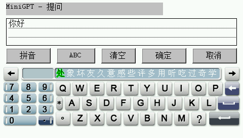
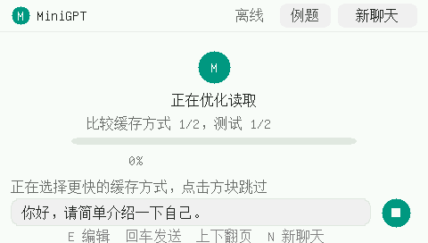

# BBKH1-MiniGPT

在步步高 **H1 / Y100 V1.41** 上本地运行 MiniMind2-Small 的原生 MIPS32 BDA。支持中文显示、系统拼音/英文输入法、ChatGPT 风格气泡聊天、触屏滚动与停止生成。设备运行无需联网或电脑推理服务。

当前 INT8 应用为 **0.3.6**，独立 INT4 应用为 **0.4.2**。两版可以同时安装。每次提问独立生成；界面保留最近 6 轮记录，模型尚未使用完整多轮聊天历史。

## 快速开始

在 [Releases](https://github.com/HelloClyde/BBKH1-MiniGPT/releases) 下载完整安装包：

| 版本 | 安装包 | 权重大小 | 主要特点 |
| --- | --- | ---: | --- |
| INT8 | `MiniGPT-H1.zip` | 26,096,156 字节 | 按层读取、常驻层缓存、MXU、自动比较多缓存一层与 DMA 双缓冲 |
| INT4 | `MiniGPT-INT4-H1.zip` | 13,819,420 字节 | 压缩权重优先全内存、双词元 MXU prefill、前缀复用；量化损失可能更明显 |

解压并按下面目录复制到设备存储盘。包内已有 `应用/程序` 目录：

```text
应用/程序/MiniGPT.bda
MiniGPT/model.mg8
MiniGPT/model.json
MiniGPT/prompt.txt

应用/程序/MiniGPT-int4.bda
MiniGPT4/model.mg4
MiniGPT4/model.json
MiniGPT4/prompt.txt
```

从 H1 的游戏/其他应用入口打开程序。点击底部输入框或按 E 编辑；系统输入法确定后点击发送或按回车。右上“例题”提供中文问题；“新聊天”清空记录和有效前缀缓存。上下键或拖动气泡区滚动；生成时点击停止方块或按 ESC 停止；返回退出。右方向键重读 UTF-8 的 `prompt.txt`。

INT8 启动依次显示模型校验、缓存预热、读取方式短测进度；可跳过可选准备阶段。查看 `minigpt.log` 的 `LOAD resident`、`LAYER_CACHE`、`CACHE_MODE` 和 `PREFILL_REUSE` 判断实际内存/缓存方式。每次启动覆盖日志，正常退出后再复制日志。回答显示在气泡中，不自动保存到 `answer.txt`。

### 开发者构建（Windows）

```powershell
git clone --recurse-submodules https://github.com/HelloClyde/BBKH1-MiniGPT.git
cd BBKH1-MiniGPT
python -m venv .venv
.venv/Scripts/Activate.ps1
python -m pip install -r requirements.txt
python tools/install_toolchain.py
python tools/build_minigpt.py
python tools/build_minigpt.py --int4
```

输出为 `dist/MiniGPT.bda` 和 `dist/MiniGPT-int4.bda`。已生成的字体、词表和 GBK 表随源码提供，**仅重建 BDA 不需要下载权重**。已有工具链可通过 `--toolchain PATH_TO_BIN` 或 `H1_GNU_BIN` 指定。SDK 固定提交在构建前检查。

完整安装包还需要从固定上游权重导出模型：

```powershell
python tools/export_release_models.py
python tools/package_release.py
```

导出脚本校验原始 safetensors SHA256 和两份量化模型 SHA256；不执行上游模型代码，不需要 PyTorch。`dist/SHA256SUMS.txt` 给出交付文件散列。更多构建/测试与字体再生方法见 [构建说明](docs/build.md)。

## 截图

以下均为本项目真实 BDA 在 **H1 V1.41 完整固件模拟器**中的截图；不是效果图。

| INT8 聊天 | INT4 聊天 |
| --- | --- |
|  |  |

| 系统中文输入法 | 启动读取方式短测 |
| --- | --- |
|  |  |

## 依赖

使用成品需要 H1/Y100 V1.41 和安装包内对应版本的模型文件。其他固件 ABI 未验证；可用连续堆空间决定 INT4 是否全内存、INT8 缓存几层。

开发构建使用：

- [BBK H1 BDA SDK](https://github.com/MrDefinition1999/bbk-h1-bda-sdk)，`sdk/` 子模块固定到 `067fe072477861dfc8949d7b1a55279fb92d2548`。H1 使用自己的 MIPS/固件 ABI。
- Windows x64 的 `mipsel-none-elf` GCC **15.2.0**；安装脚本固定下载包 SHA256。
- Python **3.11**，NumPy **2.4.6**、Pillow **12.3.0**、tokenizers **0.23.2**。Unicorn **2.1.4** 用于叶函数验证；本机 GCC 仅主机测试需要。
- 模型：[MiniMind2-Small](https://huggingface.co/jingyaogong/MiniMind2-Small)，固定版本 `8c0c0de640cd532fee03d329b95a58c56591b5bc`，8 层、隐藏维度 512、词表 6400、256 词元上下文。
- 位图字体：GNU Unifont **16.0.04** 子集；中文编辑使用设备系统输入法，应用不附带系统词库。

## 验证与限制

[验证说明](docs/verification.md) 和 `verification/` 收录主机结果与对应 BDA 的完整固件模拟器报告。独立仓库重建结果与已验证二进制逐字节相同。GitHub Actions 会从源码构建、导出模型、运行主机测试并打包，**CI 不运行或分发 H1 固件/NAND**。

MXU 使用有符号整数乘加；RMSNorm、注意力和 SwiGLU 使用软件 FP32。INT8 流式模式读取耗时仍可能占主导；INT4 文件变小不等于计算速度翻倍。模型小、中文回答质量有限，可能重复、算错或答非所问。提问连模板最多 160 词元，生成最多 96 词元。模拟器耗时不是实机速度；0.3.6 实机效果应通过新日志测量。程序不修改 CPU/PLL 频率。

## 感谢

感谢 MiniMind 作者 [jingyaogong](https://github.com/jingyaogong/minimind) 提供小模型、权重和分词器；感谢 [MrDefinition1999](https://github.com/MrDefinition1999/bbk-h1-bda-sdk) 的 H1 SDK、GNU Unifont 作者和贡献者提供字形，以及 GNU GCC/MinGW、NumPy、tokenizers 和 Unicorn 项目。

H1 freestanding libc 的初始声明/实现参考 [HelloClyde/BBK9588-gba](https://github.com/HelloClyde/BBK9588-gba) 固定提交，已替换为 H1 接口；工具链下载版本与散列沿用 [bbk9588-bda-sdk](https://github.com/HelloClyde/bbk9588-bda-sdk) 已验证设置。详见 [来源与许可](NOTICE.md)。

## 许可

应用及适配代码采用 [GPL-2.0](LICENSE)。SDK 和模型/词表分别为 Apache-2.0；字体子集选择 SIL OFL-1.1。第三方完整许可在 `LICENSES/`。固件界面截图中的第三方标识与界面不随应用 GPL 许可转授。仓库不包含原机固件、NAND、系统应用或输入法词库。
